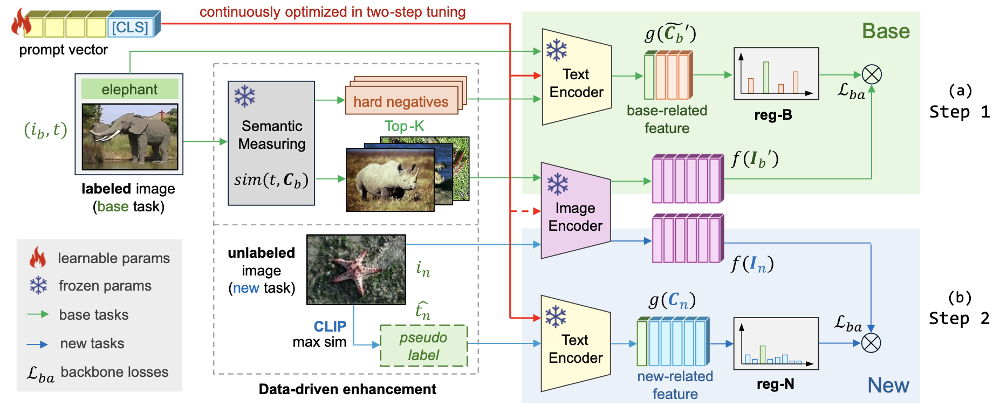
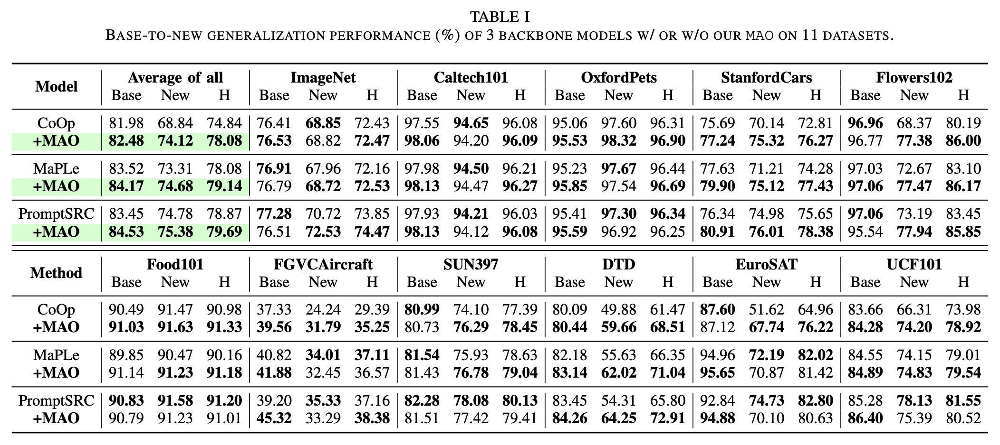
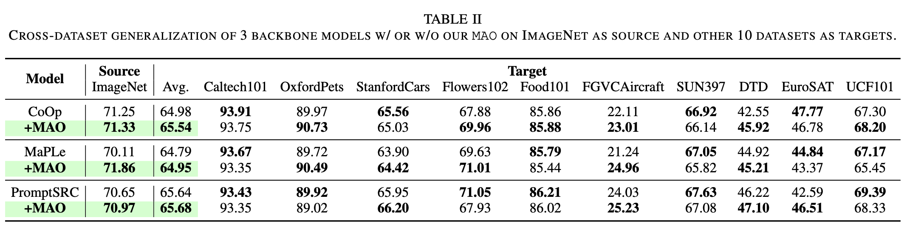

# MAO: Efficient Model-Agnostic Optimization of Prompt Tuning for Vision-Language Models 


> **[ICME 2025] MAO: Efficient Model-Agnostic Optimization of Prompt Tuning for Vision-Language Models** <br>
> Haoyang Li, Siyu Zhou, Liang Wang and Guodong Long. <br>
> Shanghai University, University of Technology Sydney <br>

**📦 Supplementary Material**: [https://github.com/JREion/M.A.O/releases/tag/docs](https://github.com/JREion/M.A.O/releases/tag/docs)

**📰 Full Text**: [https://arxiv.org/abs/2503.18160](https://arxiv.org/abs/2503.18160)

<hr />

### 🔥 News

- **NOTE**: We are preparing our code repository (mainly rewriting comments to improve readability). We hope to release code in April.

- (25 Mar. 2025) Full text and supplementary material are available at [Arxiv](https://arxiv.org/abs/2503.18160).

- (21 Mar. 2025) Our paper is accepted by ICME 2025!

<hr />

### Abstract

> Though CLIP-based prompt tuning significantly enhances pre-trained Vision-Language Models, existing research focuses on reconstructing the model architecture, e.g., additional loss calculation and meta-networks. These approaches generally lead to increased complexity and extended training cost. To maintain the efficiency of the tuning process, we propose plug-and-play **M**odel-**A**gnostic **O**ptimization (**M.A.O**) for prompt tuning. <br>
> Without altering any components of the prompt tuning backbone, we introduce a **Data-Driven Enhancement** framework to optimize the distribution of the initial data, and incorporate an **Alterable Regularization** module to boost the task-specific feature processing pipeline, thereby improving overall performance while maintaining low computational cost. Extensive experiments on MAO demonstrate its outstanding performance and efficiency.

### Framework

<div style="text-align:center"></div>

<figcaption class="content has-text-left"  style="word-break:normal">Figure 1. Framework of proposed MAO. MAO builds a <strong>two-step</strong> fine-tuning structure without altering components of prompt tuning backbones. In (a) <strong>base</strong> tasks, MAO introduces a hard negative sampler as Data-Driven Enhancement (DDE), and an Alterable Regularization (reg-B) that guides the model in learning the feature distribution of hard negatives and keeps generalization. Then in (b) <strong>new</strong> tasks, rapid pseudo-labeling is performed on unlabeled images as DDE using shared-parameter CLIP, followed by reg-N to constrain the fine-tuning on new classes. The inference process follows the settings of the original backbones.</figcaption>

### Main Contributions

(1) MAO efficiently optimizes prompt tuning backbones at data and feature level in a **plug-and-play** manner, consuming almost no additional computational resources.

(2) We introduce **task-related Data-Driven Enhancement** to MAO, improving the data distribution of base and new classes through hard negative sampling and rapid pseudo-label allocation, respectively.

(3) We incorporate **Alterable Regularization** into the procedure of feature processing, constraining the model to dynamically focus more on the features of updated data to enhance performance and generalization.

<hr />

## Experimental Results

### Base-to-New
<figure>

</figure>

### Cross-Dataset
While source accuracy improves, MAO also attains higher accuracy on multiple target datasets. Remarkably, this is achieved **without any target-task fine-tuning**.

We attribute this to MAO's **Alterable Regularization** design, which mitigates overfitting to the ImageNet source, thus guaranteeing favorable generalization to out-of-distribution data.

<figure>

</figure>


## Citation

If you find our paper or repo helpful for your research, please consider citing our paper and giving this repo a star⭐. Thank you!

```
@article{li2025mao,
  title={MAO: Efficient Model-Agnostic Optimization of Prompt Tuning for Vision-Language Models},
  author={Li, Haoyang and Zhou, Siyu and Wang, Liang and Long, Guodong},
  journal={arXiv preprint arXiv:2503.18160},
  year={2025}
}
```


## Acknowledgements

#### 🧰 Repositories
Our code is based on [DPC](https://github.com/JREion/DPC), [DePT](https://github.com/Koorye/DePT), [PromptSRC](https://github.com/muzairkhattak/PromptSRC), [MaPLe](https://github.com/muzairkhattak/multimodal-prompt-learning) and [CoOp](https://github.com/KaiyangZhou/CoOp) repository. We thank the authors for releasing their code.

#### 💖 Special Thanks
_The author extends heartfelt gratitude to the two M.A.O. — to him and to her — whose presence has enriched the soul and bestowed the strength to journey forward._
